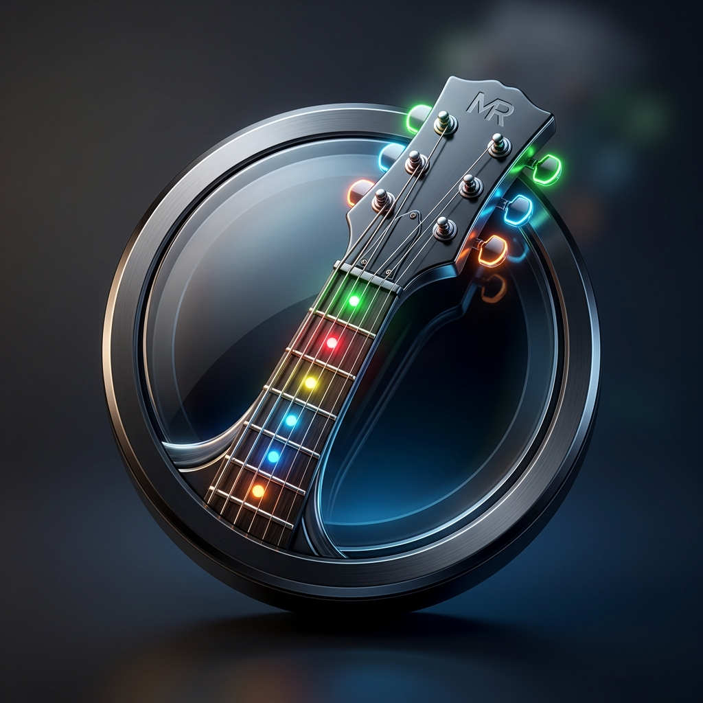

<p align="center">
  
</p>
### 🚀 [Download the Latest Release (MacRiff.zip)](https://github.com/cdapayne/MacRiff/releases/download/MacRiff/Release.MacRiff.zip)

# <p align="center">🎸 MacRiff</p>
### <p align="center">Zero-Latency Universal USB-to-Keyboard Bridge for the PDP Riffmaster Guitar (macOS)</p>

MacRiff is a lightweight, high-performance background utility that bridges the **PDP Riffmaster Wireless Guitar Dongle** directly to keyboard inputs on macOS. It is designed to work seamlessly with rhythm games like **Clone Hero**, bypassing macOS HID driver limitations to deliver a zero-latency, plug-and-play experience.

---

## 🚀 How it Works
Due to how macOS handles custom USB devices, the PDP Riffmaster wireless dongle does not register as a standard game controller out-of-the-box. MacRiff solves this using a two-part system:
1. **USB Driver Bridge (`bridge.js` & `node-usb`)**: Runs with administrative privileges to detach the macOS default HID driver and claim the raw wireless USB interfaces directly using `libusb`. It polls the guitar state at the highest USB query rate.
2. **C Key Injector (`injector`)**: Receives events from the bridge and synthesizes native macOS keyboard events (`CGEventPost`) to route them directly into the macOS window server, enabling standard game mapping.
3. **Menu Bar GUI App (`MacRiff.app`)**: A Swift-based menu bar status app that makes starting, stopping, and viewing logs a single-click experience.

---

## 🎮 Key Mappings
The guitar controls are bridged to the following keyboard and OS inputs (designed to match common rhythm game layouts):

| Guitar Control | Keyboard / OS Input | macOS Virtual Keycode | Notes |
| :--- | :---: | :---: | :--- |
| **Green Fret** | `A` | `0` | Standard fret (Main & Solo frets work) |
| **Red Fret** | `S` | `1` | Standard fret (Main & Solo frets work) |
| **Yellow Fret** | `J` | `38` | Standard fret (Main & Solo frets work) |
| **Blue Fret** | `K` | `40` | Standard fret (Main & Solo frets work) |
| **Orange Fret** | `L` | `37` | Standard fret (Main & Solo frets work) |
| **Strum Up** | `↑` (Up Arrow) | `126` | Menu navigation & strumming |
| **Strum Down** | `↓` (Down Arrow) | `125` | Menu navigation & strumming |
| **D-pad Left** | `←` (Left Arrow) | `123` | Menu navigation |
| **D-pad Right** | `→` (Right Arrow) | `124` | Menu navigation |
| **Start / Options** | `Enter` | `36` | Game pause / Start menu |
| **Select / Share** | `Escape` | `53` | Back / Menu |
| **Whammy Bar** | `Scroll Wheel` | Analog Delta | Bridges analog value to scroll speed for true axis mapping |
| **Tilt Sensor** | `Spacebar` | `49` | Triggers Star Power when guitar is tilted up |

> [!TIP]
> **Mapping Analog Whammy & Star Power in Clone Hero**:
> *   **Whammy**: In Clone Hero's controller binding screen, click to bind the **Whammy** axis, and then press down the guitar's whammy bar. The game will detect the scroll wheel pulses and bind it as a relative axis!
> *   **Star Power**: Bind the Star Power action to the **Spacebar** in Clone Hero. When you tilt your guitar up, the bridge automatically presses Spacebar to trigger Star Power.

---

## 📋 Prerequisites
1. **macOS** (Supports Apple Silicon `M1`/`M2`/`M3` and Intel processors natively).
2. **Node.js** (v16 or higher).
   - If you don't have Node.js, you can install it easily using [Homebrew](https://brew.sh):
     ```bash
     brew install node
     ```
     Or download it directly from [nodejs.org](https://nodejs.org).

---

## 📦 Installation & Setup
1. **Download the Release**: Download and extract the latest `MacRiff.app` bundle.
2. **Grant Permissions**: Copy `MacRiff.app` into your `/Applications` folder (or run it from any folder).
3. **Run the App**: Double-click `MacRiff.app`. A guitar icon `🎸 MacRiff` will appear in your menu bar.
4. **Start the Bridge**:
   - Click the `🎸 MacRiff` menu item and select **Start Bridge**.
   - You will be prompted with a native macOS password dialog. **Enter your system password** (or use Touch ID).
   > [!NOTE]
   > Administrative privileges are required to claim the raw USB device and detach the default macOS kernel drivers.
   - Once successfully connected, the menu bar icon updates to `🎸 MacRiff (Active)`.
5. **Toggle Special Inputs**: If you want to disable the analog Whammy bar (scroll wheel) and Tilt sensor (Spacebar) inputs, select **Disable Whammy & Star Power** in the dropdown. The bridge will automatically restart in the background to apply the new setting.

---

## 🔒 Security & Accessibility Permissions (CRITICAL STEP)
macOS has strict security controls (TCC) to block background apps from generating keystrokes. You **MUST** grant Accessibility permissions to both the app and the Node.js runtime for keystrokes to work.

### 1. Grant Accessibility to MacRiff.app
At startup, `MacRiff.app` will trigger a macOS system prompt asking for Accessibility permission.
- Click **Open System Settings**.
- Toggle the switch next to **MacRiff** to **ON** (blue).
*(If you missed the prompt, go to: **System Settings** > **Privacy & Security** > **Accessibility**, and add/toggle **MacRiff**).*

### 2. Grant Accessibility to Node.js (Very Important!)
Because `MacRiff.app` runs `bridge.js` using Node.js, the actual keypresses are generated by the `node` process. **You must also grant Accessibility permissions to the `node` binary.**
- Open **System Settings** > **Privacy & Security** > **Accessibility**.
- Click the `+` (plus) button at the bottom of the list.
- Enter your password to unlock the settings.
- Find your `node` binary and add it.
  - **Where is my `node` binary?**
    - If you installed Node.js via Homebrew (Apple Silicon): `/opt/homebrew/bin/node`
    - If you installed Node.js via Homebrew (Intel): `/usr/local/bin/node`
    - If you used NVM or another installer, open a Terminal and type:
      ```bash
      which node
      ```
      This will print the exact path (e.g., `/Users/username/.nvm/versions/node/v20.x.x/bin/node`).
  - **How to select it in the File Dialog?**
    - When the file dialog opens, press `Cmd + Shift + G` to open the "Go to folder" search bar.
    - Paste the path to your node binary (e.g., `/opt/homebrew/bin/node`) and press **Go** (or Enter).
    - Select `node` and click **Open**.
    - Ensure it is toggled **ON** in the Accessibility list.

---

## 🛠️ Troubleshooting
### ❓ The status says "Running" (Active), but no keypresses are registered in Clone Hero or Text Edit!
This is a 100% permission inheritance issue.
1. Go to **System Settings > Privacy & Security > Accessibility**.
2. Locate **node** and **MacRiff** in the list.
3. Toggle them **OFF**, wait 2 seconds, and toggle them **ON** again. (macOS sometimes fails to register permissions for binaries that are recompiled or updated).
4. Restart `MacRiff.app`.

### ❓ The status stays "Stopped" or fails to start.
1. Click **View Logs...** in the menu dropdown (or open the log file at `/tmp/macriff.log`).
2. If you see:
   - `PDP Riffmaster Dongle NOT found!`: Ensure the wireless USB dongle is plugged into your Mac and the LED light is solid (paired with the guitar).
   - `Failed to claim interface`: Ensure you entered your sudo password correctly. Another program might be claiming the dongle. Try unplugging and re-plugging the dongle.

---

## 💻 Developer Guide: Building from Source
If you want to compile or package MacRiff yourself:

1. **Clone the Repository**:
   ```bash
   git clone https://github.com/cdapayne/MacRiff.git
   cd MacRiff
   ```
2. **Install Dependencies**:
   ```bash
   npm install
   ```
3. **Compile the Key Injector**:
   ```bash
   npm run build
   ```
   *This compiles `injector.c` into a native universal binary supporting both Intel and Apple Silicon.*
4. **Package the App Bundle**:
   ```bash
   npm run package
   ```
   *This compiles the Swift menu helper `menu.swift` as a universal binary, builds the `MacRiff.app` structure under the root directory, copies dependencies, and signs it.*

---

## ☕ Support & Donations
If **MacRiff** helped you get your PDP Riffmaster guitar working on macOS, consider supporting this project! Reverse-engineering USB protocols, compiling universal binaries, and maintaining driver bridges takes time and effort. 

If you'd like to buy me a coffee, you can donate via:
*   **PayPal**: [paypal.me/YOUR_PAYPAL_USERNAME](https://paypal.me/cp3izzle) (Best for international / credit card donations)
*   **Cash App**: [`$YOUR_CASHAPP_USERNAME`](https://cash.app/$cdapayne) (Best for US-based donations)


---

## 📄 License
MIT License. Feel free to modify and distribute!
